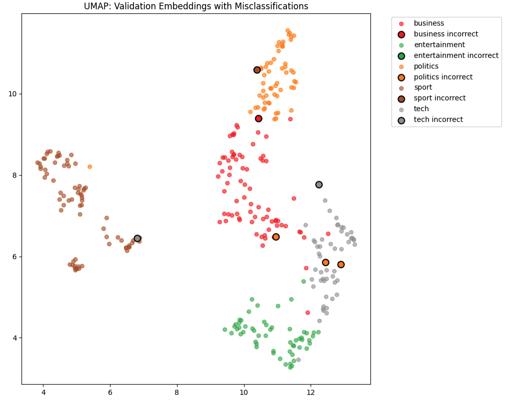

# bbc-news-challenge

## Problem Statement

Build a multi-class classifier on the [BBC News dataset](https://huggingface.co/datasets/SetFit/bbc-news), consisting of ~2,000 articles across five topics: business, entertainment, politics, sports, and tech.

The goal is to correctly classify each article into one of these topics. This is framed as a 5-class classification task.


## Approach

### 1. Design Overview

- **EDA** (see `/src/notebooks/eda.ipynb`) revealed:
  - All text is lowercase with little punctuation.
  - Classes are well balanced.
  - 80% of articles have ≤20 unique words.
  - Top words are distinct per topic, suggesting simple models may perform well.

- **Three models** (see `/src/notebooks/models.ipynb`) were trained to compare performance:
  
| Model     | Feature Extraction      | Classifier           | Hyperparameter Tuning         | F1 Score | Accuracy |
|-----------|--------------------------|-----------------------|-------------------------------|----------|----------|
| Baseline  | TF-IDF (1k vocab, stopwords removed) | Logistic Regression   | No                            | 0.96     | 0.96     |
| Model 2   | Sentence Transformers (`all-MiniLM-L6-v2`) | Logistic Regression   | No                            | 0.98     | 0.98     |
| Model 3   | Sentence Transformers (`all-MiniLM-L6-v2`)   | XGBoost               | 100 trials (random CV)        | 0.96     | 0.96     |


- **TF-IDF + Logistic Regression**: A strong, interpretable baseline requiring no tuning.
- **Sentence Transformers**: Used for richer semantic embeddings. Improved performance and generalisation.
- **XGBoost**: Tried for non-linear modeling, but offered no significant gain over logistic regression.

- **Metric Choice**:
  - **Accuracy** is appropriate due to balanced classes.
  - **Weighted F1** is also reported to account for label-specific precision/recall.

## Error Analysis

Error analysis for the best performing model (model 2) on the validation set used for comparing models is below. Error analysis for other models can be found in the notebook.

- **UMAP** plots show that misclassified points lie further from their true topic clusters.

    

- **Confidence plots** (max predicted probability) reveal that errors tend to occur at low confidence.

    

- **Confusion matrix** shows most errors are semantic overlaps (e.g. business vs politics):

    

- **LIME** was attempted to interpret transformer-based predictions but was less effective due to embeddings not being token-based. This is not included in the final pipeline as it is slow and adds little value.

## Reproducibility

### Dockerised Pipeline

Model 2 (Sentence Transformers + Logistic Regression) was productionised.

- To train and evaluate, run the following from the **root project directory**:

```bash
make run-docker
```
- This runs `src/pipeline.py` inside Docker using configuration from `src/config.py` (and `config.yaml`).
- All results are saved **locally** to the `artifacts/` directory, including metrics, plots, and model files.
- Logs are saved to `artifacts/app.log` **locally**.

### Local Usage
- Additional `make` commands are available to lint, test and run the code locally.
- To run notebooks, run the below commands and then open the notebook with the “BBC News” kernel:
    ```bash
    python3 -m venv bbc-env
	./bbc-env/bin/pip install -r requirements.txt
    python -m ipykernel install --user --name=bbc-news --display-name "BBC News"
    ```

## Future Improvements

### Model
- Fine-tune BERT (e.g., unfrozen classification head and other layers) for potentially higher performance.
- Improve TF-IDF preprocessing: try bigrams, lemmatisation (e.g., via spaCy).

### Pipeline
- Add inference pipeline or API.
- Add MLflow for experiment tracking.
- Add pre-commit hooks for quality enforcement.

## Repo Structure

```
.
├── artifacts/              # data, models, plots, logs
├── config.yaml             # config
├── src/
│   ├── config.py           # Pydantic class for config.yaml
│   ├── pipeline.py         # main runner script
│   └── steps/              # modules for preprocessing, training, etc.
├── requirements.txt
├── requirements-dev.txt
├── Dockerfile
├── Makefile
└── README.md
```